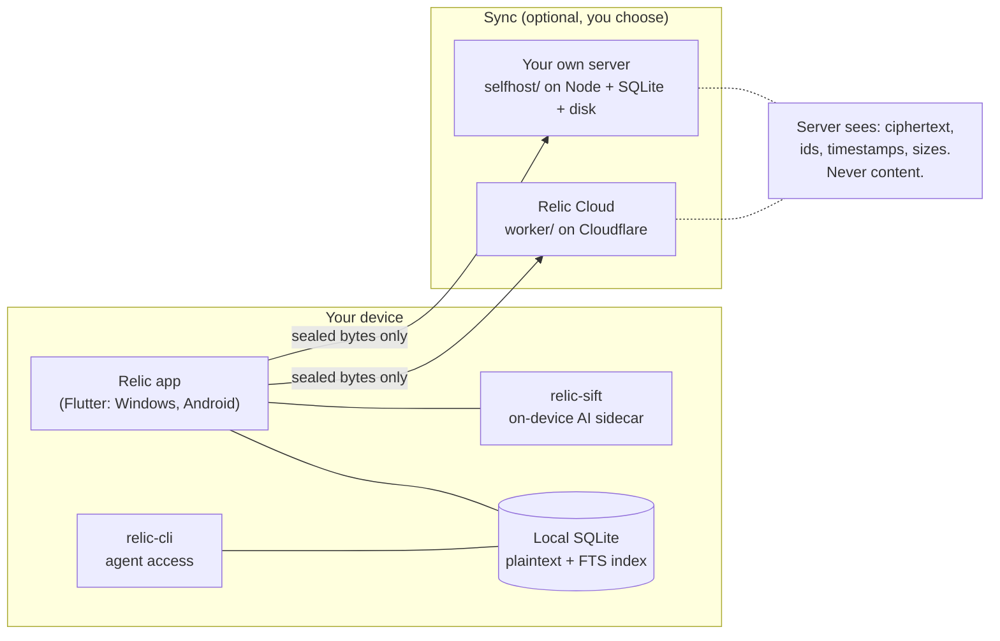

<div align="center">

# Relic

### Copy it once. Keep it forever.

**An end-to-end-encrypted, cross-platform vault for everything you copy.**
Every string, screenshot, and file you copy is captured, kept, and searchable
forever. On your devices, sealed before it leaves them.

[](./LICENSE)
[](./crypto/LICENSE)
[](#install)

</div>

<!-- demo.gif: agent-recall demo goes here -->

## What it is

- **Local-first.** Your whole vault lives on your device in plain SQLite with a
  full-text index. Search is instant and works offline. A fresh install never
  touches the network until you connect it to something.
- **End-to-end encrypted.** Content is sealed on your device with
  XChaCha20-Poly1305 under a master key wrapped by your passphrase via Argon2id
  (64 MiB, pinned parameters). A server only ever holds ciphertext.
- **On-device AI.** Classification, OCR, image tagging, titling, and semantic
  search run locally in a Rust sidecar. Nothing is sent anywhere to be
  understood.
- **Sync is optional.** Turn it on and pick who holds the encrypted pipe:
  [Relic Cloud](https://relic.space) or a server you run yourself. Both run the
  same code in this repo, and neither can read anything.

## Install

| Platform | How |
|---|---|
| **Windows** | `winget install --id Relic.Relic` |
| **Android** | [Google Play](https://play.google.com/store/apps/details?id=relic.space.app) |
| **macOS, iPhone, Linux** | Coming soon |
| **From source** | [`BUILD.md`](./BUILD.md) — every component builds from a clean checkout with no secret of ours |

The app is local-only until you connect it. Sync, when you want it, is free on
the free tier, $7/mo or $60/yr for Pro, and $12/mo or $96/yr for Max. Running
your own server is free forever.

## Run your own server

One command, prebuilt multi-arch image (x86 and ARM, so a Raspberry Pi or a NAS
is fine):

```sh
docker run -d --name relic \
  -p 8787:8787 \
  -v relic-data:/data \
  ghcr.io/relicsync/relic-selfhost
```

Then in the app: **Settings → Connect… → Your own server**, enter
`http://<your-host>:8787` and a passphrase. There are no accounts and no
configuration. The first device to connect claims the instance; every later
device that types the same passphrase joins it. Full guide:
[`selfhost/README.md`](./selfhost/README.md).

Because Relic is local-first and end-to-end encrypted, you are never locked in.
Move between your own server and Relic Cloud whenever you like.

## Verify the crypto yourself

The encryption is a standalone Apache-2.0 package, and it is the exact code the
apps run. The pinned vectors take seconds and need no Flutter and no app
checkout:

```sh
cd crypto
dart pub get
dart test
```

That checks the Argon2id derivation against its reference value, round-trips
real item, blob, backup, and share ciphertext, and proves the AAD context
binding by showing that a ciphertext moved to a different context fails to
decrypt.

There is a second, independent implementation in the same folder:
[`crypto/js/`](./crypto/js) is the TypeScript that the hosted web vault ships to
every browser. It is byte-verified against the Dart one, so you can read either
and check both. The contract they both implement is
[`docs/crypto.md`](./docs/crypto.md) and
[`docs/wire-format.md`](./docs/wire-format.md).

## Architecture



Search, classification, and display all happen on the plaintext side of that
line. The sync side only ever moves sealed bytes plus the few plaintext fields
the server needs to order and page them, listed field by field in
[`docs/wire-format.md`](./docs/wire-format.md).

## What's in this repo

```
app/            Flutter client: Windows, Android, macOS in progress
relic-sift/     on-device AI: classification, OCR, labeling, embeddings
worker/         Cloudflare Worker sync server (this is what Relic Cloud runs)
selfhost/       the same worker on plain Node + SQLite + local disk
relic-core/     Rust core types, deterministic classification, FTS reference
relic-cli/      agent-facing CLI over the local vault, plus its embedded skill
crypto/         Apache-2.0 client crypto: Dart package + the JS implementation
docs/           SPEC.md and the contract docs (crypto, wire format, API)
Cargo.toml      Rust workspace (core, sift, cli)
codemagic.yaml  macOS/iOS cloud build lane (no secrets in-tree)
```

Building any of it: [`BUILD.md`](./BUILD.md).

## For coding agents

[`AGENTS.md`](./AGENTS.md) is the machine-readable contract: detect, install per
OS, build from source as a fallback, and drive a vault from the terminal through
`relic-cli`. Point your agent at it and it can install Relic and then recall
things you copied weeks ago.

## Security

Disclosure process, the threat model, and what the encryption does and does not
protect: [`SECURITY.md`](./SECURITY.md).

## Contributing

Small, focused pull requests are welcome under the DCO. See
[`CONTRIBUTING.md`](./CONTRIBUTING.md). The name and logo are handled separately
from the code: [`TRADEMARK.md`](./TRADEMARK.md).

## License

[GNU AGPL-3.0](./LICENSE) for the app, the AI sidecar, the server, the CLI, and
the core. You are free to run, study, modify, and self-host all of it. The
AGPL's network copyleft means anyone who offers a modified version of this
server as a service has to share their changes under the same license. It is the
same license Bitwarden and Standard Notes use, for the same reason: it keeps the
project genuinely open while keeping the hosted business sustainable.

The `crypto/` package is [Apache-2.0](./crypto/LICENSE) instead, deliberately.
Verification code should be as easy to read, reuse, and reimplement as possible,
and a copyleft license on it would work against that.
