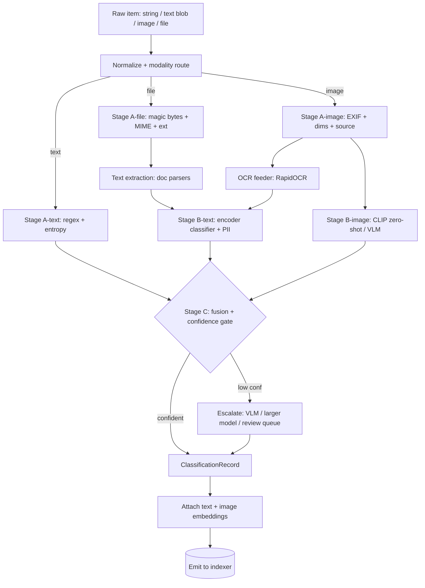

# Relic — `sift` Classification Pipeline

**Technical Specification v0.1**
**Date:** June 2026
**License:** Apache-2.0 (project); component licenses tracked in §15
**Status:** v0.1 implemented in this crate (see [README.md](README.md); deltas: ocrs stands in for RapidOCR, CLIP ViT-B/32 stands in for SigLIP2 per §16.1, no VLM escalation yet)

---

## 0. What this document is

`sift` is the classification subsystem of **Relic**, a fully-local, cross-platform
(Windows / macOS / Android / iOS) personal capture-and-recall app. This spec covers
**only the classification pipeline**: the path from a raw input item to a structured
classification record plus the derived artifacts (extracted text, embeddings, entity
spans) that the rest of Relic indexes.

**In scope:** input normalization, modality routing, the deterministic + ML
classifier cascade, confidence fusion, the model registry, and the output contract.

**Explicitly out of scope** (other Relic modules own these): folder/clipboard
watchers and OS ingestion hooks, the SQLite/FTS5/`sqlite-vec` storage engine,
the search/query layer, and the UI shell. `sift` only *emits* records; it never
writes the index itself.

---

## 1. Design principles

1. **Local-only.** No bytes leave the device. No network calls on the hot path. This
   is a hard requirement, not a setting.
2. **Cheap-before-expensive.** Every item passes through deterministic rules first;
   models run only on what rules can't resolve confidently.
3. **One runtime, one model format.** All ML models ship as quantized **ONNX** and run
   on **ONNX Runtime**, the only inference runtime that spans all four targets plus
   WASM. Platform accelerators (CoreML, NNAPI/QNN, DirectML) are execution providers
   under the same API — never separate code paths.
4. **Store raw + derived.** The pipeline preserves the original item and all derived
   text/embeddings so the archive can be **re-classified** later with an improved model
   without re-OCR or re-ingest.
5. **Explainable decisions.** Every classification records *which* stage and *which*
   signal produced it (`provenance`), so results are auditable.
6. **Graceful degradation.** Any model can be absent (e.g. a minimal mobile build with
   no VLM); the pipeline falls back to whatever stages are available and lowers
   confidence accordingly.

---

## 2. High-level architecture



The pipeline is a three-stage cascade (**A** deterministic → **B** small ML →
**C** fusion/escalation) wrapped by normalization at the front and embedding
attachment at the back.

---

## 3. Taxonomy (category schema)

Categories are a **versioned, extensible enum** loaded from `taxonomy.json`, not
hard-coded. The pipeline emits one **primary** category plus a full score vector, so
re-tagging after a taxonomy change is a pure recompute over stored embeddings.

Seed taxonomy v1 (each entry has: `id`, `modality`, `detector_hints`, `threshold`):

| id              | modality | typical detector                          |
|-----------------|----------|-------------------------------------------|
| `api_key`       | text     | regex + entropy (Stage A)                 |
| `secret_other`  | text     | regex + entropy (tokens, keys, JWT)       |
| `email_body`    | text     | encoder classifier (Stage B)              |
| `chat_message`  | text     | encoder classifier                        |
| `code`          | text     | regex + encoder                           |
| `log_line`      | text     | regex + encoder                           |
| `note_prose`    | text     | encoder classifier                        |
| `url`           | text     | regex                                     |
| `pii_present`   | text     | PII model / Presidio (multi-label flag)   |
| `screenshot`    | image    | EXIF heuristic + CLIP                      |
| `photo`         | image    | EXIF heuristic + CLIP                      |
| `document_scan` | image    | CLIP + OCR text density                   |
| `receipt`       | image    | CLIP + OCR keywords                        |
| `diagram`       | image    | CLIP                                      |
| `meme`          | image    | CLIP                                      |
| `file_pdf` …    | file     | magic bytes → routed to text extraction   |

`pii_present` is a **label, not a category** — it co-occurs with any text category and
is carried as a flag plus entity spans.

---

## 4. Stage 0 — Normalization & modality routing

**Input adapter** accepts four source kinds and produces a `NormalizedItem`:

```
NormalizedItem {
  raw_ref:      bytes | path        # original, untouched
  source_kind:  "string" | "textblob" | "image" | "file"
  declared_mime: string | null      # from clipboard/OS, advisory only
  origin:       { app?, path?, clipboard?, share_sheet? }
}
```

Routing rules (in order):
1. `string` / `textblob` → **text path**.
2. `image` (png/jpg/webp/heic/screenshot) → **image path**.
3. `file` → sniff **magic bytes** (do not trust extension):
   - text-extractable doc (pdf/docx/xlsx/pptx/md/txt/html) → extract → **text path**.
   - raster image container → **image path**.
   - code/source by extension+content → **text path**, tagged `code`.
   - unknown/binary → emit `file_binary` with metadata only (no content classify).

Doc text extraction uses **Docling** (PDF/office, layout-aware) with a `pdfium`/
`textract`-class fallback. Extraction is a *feeder*, not a classifier — its output
re-enters the text path as a `textblob`.

---

## 5. Stage A — Deterministic classifiers (no ML)

High-precision, near-zero-cost, fully explainable. Resolves the majority of items.

### 5.1 Text deterministic (`A-text`)
- **Secret/credential regex + Shannon entropy.** Ruleset seeded from the gitleaks /
  `detect-secrets` patterns (AWS keys, GitHub/GitLab tokens, JWTs, private-key PEM
  blocks, high-entropy base64/hex of plausible length). A match with entropy above the
  per-rule floor → `api_key` / `secret_other` at **confidence 0.97**.
- **Structural regex.** URL, email address, IPv4/6, UUID, credit-card (Luhn-checked),
  phone → contributes `url`, and feeds `pii_present`.
- **Format heuristics.** JSON/XML/YAML shape, stack-trace shape, `code` token density,
  log-line timestamp prefixes → weak priors (confidence ≤ 0.6) passed to Stage B.

### 5.2 File deterministic (`A-file`)
- libmagic signature → canonical MIME → routes to extraction or image path.
- Sets `file_*` category and records true MIME regardless of extension.

### 5.3 Image deterministic (`A-image`)
- **EXIF presence + camera tags** → strong prior for `photo`.
- **No EXIF + screen-typical dimensions / aspect ratio / pixel-density + source app =
  screenshot tool** → strong prior for `screenshot`.
- These are *priors* (confidence ≤ 0.75), not final — Stage B confirms, because EXIF can
  be stripped from photos and present on edited screenshots.

**Stage A output:** zero or more `(category, score, provenance="rule:<name>")` votes.

---

## 6. Stage B — Small local ML classifiers

Runs only on items Stage A did not resolve at or above the category's confidence floor.

### 6.1 Text encoder classifier (`B-text`)
- **Embedding model:** `bge-small-en-v1.5` (or multilingual `e5-small`) → ONNX int8,
  CPU-fast. Produces a 384-d sentence embedding (also reused downstream as the search
  vector — embed once).
- **Head:** lightweight classifier over the embedding for content-type buckets
  (`email_body`, `chat_message`, `note_prose`, `code`, `log_line`, …). Two interchangeable
  implementations:
  - **(default) logistic-regression / linear head** trained on labeled + rule-bootstrapped
    examples. Tiny, retrainable on-device, lets users add categories without touching the
    encoder.
  - **(optional) fine-tuned ModernBERT-base** end-to-end classifier for higher accuracy
    where the budget allows.
- **PII / sensitive context:** for context-aware detection beyond regex, an optional
  **token-classification PII model** (e.g. an OpenAI-Privacy-Filter-class local model) or
  **Microsoft Presidio**. Emits `pii_present` + typed entity spans for masking downstream.

### 6.2 Image classifier (`B-image`)
- **Zero-shot CLIP head (default):** **SigLIP2-base** (or **MobileCLIP** for the smallest
  mobile build — see license note in §15). Candidate label strings come straight from the
  taxonomy (`"a screenshot"`, `"a photograph"`, `"a scanned document"`, `"a receipt"`,
  `"a diagram"`). Cosine-max over labels → category + score. No training, new categories =
  new strings.
- **OCR feeder:** **RapidOCR** (ONNX, ~80MB) runs on every image to extract text, which
  (a) re-enters the **text path** so a screenshot of an API key still gets caught as
  `api_key`, and (b) provides **text-density** and keyword signals that sharpen
  `document_scan` / `receipt` vs `photo`.
  - *Routing optimization:* if `A-image` already says screenshot with high prior, use a
    fast/tiny OCR profile (clean rendered text is easy); reserve the full RapidOCR model
    for camera photos.
- The image embedding from the CLIP model is retained as the visual search vector.

### 6.3 Optional unified VLM (`B-vlm`, escalation only)
- A tiny VLM (**SmolVLM** ~0.25–0.5B or **Moondream2** ~0.5B, 4-bit GGUF / ONNX) can do
  OCR **+** caption **+** category in one pass. It is **not** on the default hot path
  (compute cost); it is the **escalation target** for low-confidence images and the
  one-model option for minimal-plumbing builds.

---

## 7. Stage C — Fusion, confidence gating & escalation

### 7.1 Fusion algorithm

```
inputs:  votes = list of (category, score, provenance, stage)
         T[c]  = per-category confidence threshold from taxonomy

1. Group votes by category; combine scores with a noisy-OR
   (rules and models are treated as independent evidence).
2. primary = argmax(combined_score)
3. conf    = combined_score[primary]
4. if a Stage-A rule fired with score >= 0.95 (e.g. secret regex+entropy):
       primary := that category            # deterministic wins outright
       conf    := rule score
   else if Stage-A prior and Stage-B model DISAGREE:
       primary := Stage-B (model) category  # model overrides weak prior
       conf    := combined_score[primary] * 0.9   # penalize the conflict
       flag DISAGREEMENT  -> training-data candidate
5. if conf < T[primary]:
       route to ESCALATION
6. emit ClassificationRecord with primary, full score vector, conf, provenance
```

### 7.2 Per-category thresholds (calibration)
- Thresholds are **per-category** because cost asymmetry differs. `api_key` biases toward
  recall (a missed leaked secret is expensive → low threshold, flag-on-doubt).
  `meme` / `note_prose` can sit higher. Thresholds live in `taxonomy.json` and are tuned
  on the golden set (§14) via temperature/Platt scaling so `conf` is a real probability.

### 7.3 Escalation ladder
1. **Re-run with the VLM** (images) or **ModernBERT head** (text) if present.
2. Still below threshold → set `primary = "unsorted"`, `needs_review = true`, and queue
   for the optional user-review surface (owned by the UI module).
3. Disagreements and reviewed items are logged as **labeled training data** to improve the
   on-device heads over time.

---

## 8. Model registry

| Role                 | Default model                | Format      | Approx size (int8/4-bit) | Platform notes |
|----------------------|------------------------------|-------------|--------------------------|----------------|
| Inference runtime    | ONNX Runtime                 | —           | 10–30 MB                 | all four + WASM; EPs: CoreML / NNAPI-QNN / DirectML |
| OCR                  | RapidOCR (det+rec+cls)       | ONNX        | ~80 MB                   | sub-second CPU; tiny profile for screenshots |
| OCR (Apple builds)   | Apple Vision OCR             | native      | 0 (system)               | use instead of bundling on iOS/macOS |
| Text embedding       | bge-small-en / e5-small      | ONNX int8   | 30–130 MB                | doubles as search vector |
| Text classifier head | linear head (default)        | tiny        | <5 MB                    | retrainable on-device |
| Text classifier (opt)| ModernBERT-base finetune     | ONNX int8   | ~150 MB                  | higher accuracy |
| PII (context)        | Privacy-Filter-class / Presidio | ONNX / rules | 0–150 MB              | emits entity spans |
| Image zero-shot      | SigLIP2-base                 | ONNX int8   | ~200–350 MB              | clearly-open weights |
| Image zero-shot (sm) | MobileCLIP (S0/S2)           | ONNX        | 50–150 MB                | smallest; **verify license §15** |
| Unified VLM (opt)    | SmolVLM / Moondream2         | GGUF/ONNX 4-bit | 0.3–1.5 GB           | escalation / minimal-plumbing only |

**Size budgets:** dedicated-models build (no VLM) ≈ **250–600 MB**. With a small VLM ≈
**0.8–2 GB**. Relic's 2 GB app ceiling is comfortable unless a large VLM is bundled.

---

## 9. Output contract

The pipeline's sole product is a `ClassificationRecord` (JSON). The indexer consumes it;
`sift` never touches storage.

```jsonc
{
  "item_id":        "blake3:…",            // content hash, dedup key
  "schema_version": "sift/0.1",
  "source_kind":    "image",
  "mime":           "image/png",
  "category": {
    "primary":   "screenshot",
    "scores":    { "screenshot": 0.94, "photo": 0.05, "document_scan": 0.01 },
    "confidence": 0.94,
    "needs_review": false
  },
  "labels":         ["pii_present"],        // multi-label flags
  "extracted_text": "…full OCR / doc text…",
  "entities": [
    { "type": "EMAIL", "span": [120, 141], "value_masked": "j•••@•••.com" }
  ],
  "embeddings": {
    "text":  { "model": "bge-small@int8", "dim": 384, "ref": "vec:…" },
    "image": { "model": "siglip2-base",   "dim": 768, "ref": "vec:…" }
  },
  "provenance": [
    { "stage": "A-image", "signal": "no_exif+screen_dims", "score": 0.7 },
    { "stage": "B-image", "signal": "siglip2_zeroshot",    "score": 0.94 }
  ],
  "model_versions": { "ocr": "rapidocr-2.x", "img": "siglip2-base", "emb": "bge-small-1.5" },
  "timing_ms":      { "stage_a": 1, "ocr": 180, "stage_b": 60, "total": 245 },
  "created_at":     "2026-06-11T00:00:00Z"
}
```

### 9.1 Interface (language-agnostic, expressed in Rust-ish pseudotypes)

```rust
trait Classifier {
    /// Synchronous, single-item. Pure w.r.t. storage.
    fn classify(&self, item: NormalizedItem, ctx: &ModelCtx) -> ClassificationRecord;
    /// Re-run classification over stored derived artifacts (no re-OCR/re-extract).
    fn reclassify(&self, prior: &ClassificationRecord, ctx: &ModelCtx) -> ClassificationRecord;
}
```

The same shared-core API is callable from Flutter (FFI) or a Tauri Rust backend.

---

## 10. Runtime, packaging & platform matrix

- **Shared core (write-once):** normalization, Stage A rules, fusion, ONNX inference
  calls, output serialization. Compiled per-platform from one Rust (or C++) crate.
- **Per-platform glue:** OCR provider selection (Apple Vision vs RapidOCR), execution
  provider, model file locations, threading.

| Concern        | Win/macOS desktop | Android        | iOS                |
|----------------|-------------------|----------------|--------------------|
| EP             | DirectML / CoreML | NNAPI / QNN    | CoreML             |
| OCR            | RapidOCR          | RapidOCR       | Apple Vision (free)|
| Threading      | full              | full           | constrained        |
| VLM bundled?   | optional          | optional (sm)  | usually no         |

> Note: `sift` is **stateless and synchronous**; it does not depend on background
> execution. The ambient-vs-share-sheet ingestion difference across platforms is the
> *ingest* module's problem, not the classifier's.

---

## 11. Performance targets (per item, CPU, mid-range hardware)

| Path                         | p50 latency | peak RAM |
|------------------------------|-------------|----------|
| Text, Stage A only           | < 2 ms      | trivial  |
| Text, Stage A + B            | < 80 ms     | < 200 MB |
| Image, screenshot (fast OCR) | < 150 ms    | < 300 MB |
| Image, photo (full OCR+CLIP) | < 400 ms    | < 500 MB |
| Image, VLM escalation        | 1–4 s       | < 1.5 GB |

Throughput is non-critical (personal scale, background); these are responsiveness
ceilings, not SLAs.

---

## 12. Privacy & security

- No network on the classification path; builds ship with networking compiled out of the
  core where the platform allows, and a runtime assertion otherwise.
- `value_masked` is emitted for detected secrets/PII; raw secret values are **never**
  placed in the searchable text field — only a masked form plus a typed span. (The raw
  item is retained encrypted at rest by the storage module; `sift` passes a reference.)
- Provenance + model_versions make every decision reproducible and auditable.

---

## 13. Extensibility & re-classification

- **Add a category:** append to `taxonomy.json` (+ a CLIP label string and/or head
  retrain). For zero-shot image categories, no retrain at all.
- **Improve a model:** bump the model version; run `reclassify()` over the archive using
  stored `extracted_text` + `embeddings`. No re-OCR, no re-ingest.
- **User feedback loop:** review-queue corrections and Stage A↔B disagreements accumulate
  as on-device labeled data to retrain the linear head incrementally.

---

## 14. Evaluation & QA

- **Golden set:** a held-out, per-category labeled corpus (text strings + images),
  including adversarial cases (EXIF-stripped photos, edited screenshots, obfuscated keys,
  non-standard token formats).
- **Metrics:** per-category precision/recall/F1; secret-detection **recall** tracked
  separately as the safety-critical metric; calibration error (ECE) for confidence.
- **Regression gate:** model/threshold changes must not drop `api_key` recall or overall
  macro-F1 below baselines before merge.
- **Variance:** evaluate across platforms/EPs since quantization + accelerator can shift
  outputs.

---

## 15. Dependencies & license summary

| Component            | License            | OSS-clean for redistribution |
|----------------------|--------------------|------------------------------|
| ONNX Runtime         | MIT                | yes                          |
| RapidOCR             | Apache-2.0         | yes                          |
| bge-small / e5-small | MIT / MIT          | yes                          |
| SigLIP2 weights      | open (verify exact terms) | verify before ship    |
| MobileCLIP weights   | Apple ML license   | **verify** — may restrict redistribution |
| SmolVLM              | Apache-2.0         | yes                          |
| Moondream2           | Apache-2.0         | yes                          |
| Presidio             | MIT                | yes                          |
| Docling              | MIT                | yes                          |
| gitleaks rulesets    | MIT                | yes (rules, not the binary)  |

**Action item:** confirm SigLIP2 and MobileCLIP redistribution terms before bundling; if
either is non-permissive, default the image classifier to the clearly-Apache fallback and
treat the other as a user-opt download.

---

## 16. Open questions / risks

1. **Image-classifier license** (above) — pick the default that keeps the shipped package
   100% redistributable; offer others as optional downloads.
2. **iOS OCR parity** — Apple Vision is excellent and free but its output format differs
   from RapidOCR; normalize both to a common token/box schema.
3. **Quantization drift** — int8/4-bit + accelerator EPs can change borderline decisions;
   lock a per-platform golden-set baseline.
4. **PII model footprint vs value** — decide whether context-aware PII (a real model)
   earns its size on mobile, or whether regex + Presidio rules suffice there.
5. **Multilingual** — seed taxonomy/heads are English-first; e5-small + PaddleOCR/RapidOCR
   multilingual models extend coverage when needed.

---

*End of `sift` v0.1 spec.*
